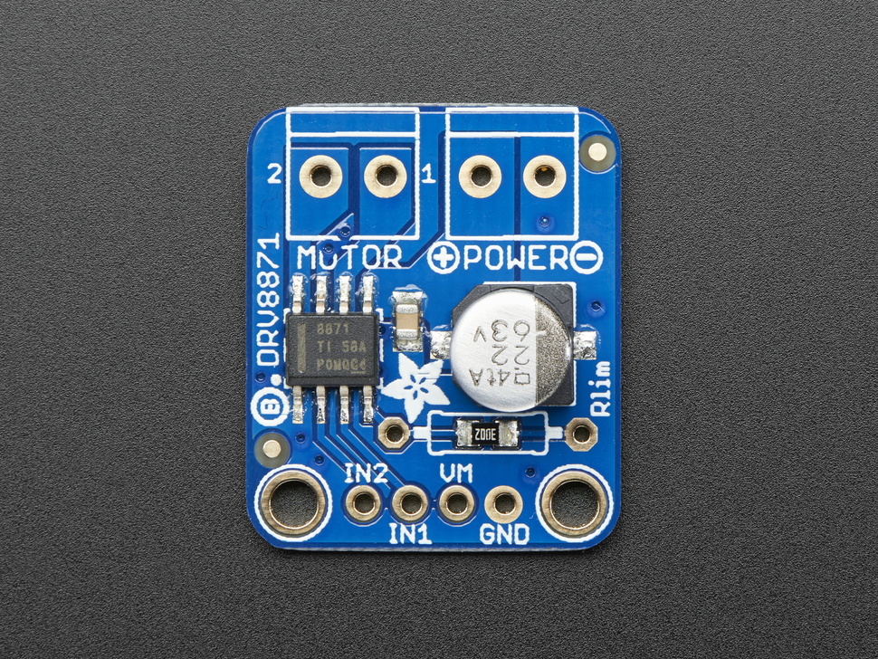
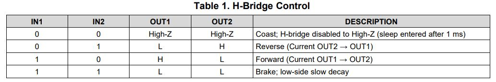
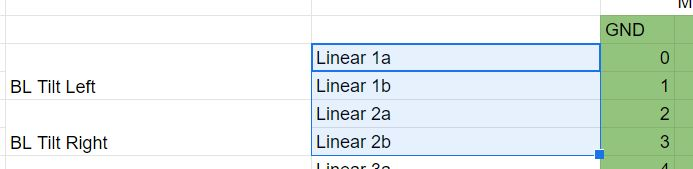
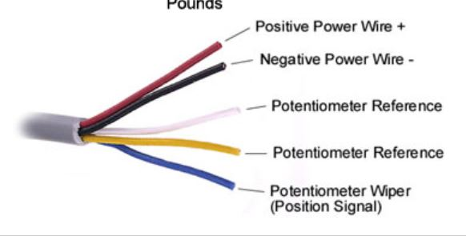
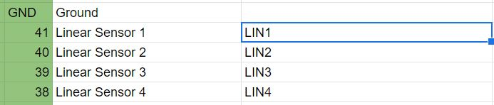
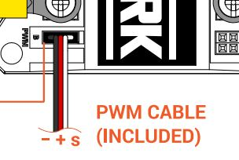
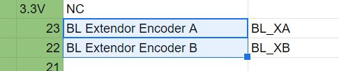

# Bucketladder Class

**Purpose:**
___
This class will contain methods that will control the bucketladder. 

____
**Basic movements:**
____

So the bucketladder has 3 types of movements:
1. Extend/Retract (Vertical)
2. Extend/Retract (Horizontal)
3. Dig

**Extend/Retract (Vertical)**
To help visualize this essentially think of the linear actuators that help angle/life the auger towards the ground for last year's design. 

This movement will be controlled by the HDA-4 Linear Actuator.

 

**Extend/Retract (Horizontal)**
To help visualize this essentially think of the telescoping system that moves the auger tube up and down.

This movement will be controlled by the Mini CIM motor. Furthermore the distance of how far it has extended and retracted will be tracked by the CIM motor encoder.

 

**Dig**
Essentially the auger rotating but this time its a bucketladder.

This movement will be controlled by the BAG motor.

 

**ALL OF THESE MOVEMENTS CAN GO FORWARDS OR BACKWARDS BASED ON CONTEXT**

____
**Speed adjustment:**
____

Linear Actuators have no need to be adjusted for their speed (they're pretty much slow based on Maurice's experience with them)

I would think the only things that need speed adjustment would be the digging and horizontal extension. How to adjust the speed would be through PWM. 

Now there are 2 ways to do that either through the servo library that Maurice has used, or through the usage of the pulse mapping.

I recommend using the servo library and understanding how it works. A great starter would be working with an arduino servo that comes from one of the kits or a DC motor.

____
**Hardware Interface:**
____

**DRV8871 Motor Controller:**
For the linear actuators, those will be controlled via the DRV8871 Motor controller drivers. The only two inputs that are interfacing with the Teensy is the In1 and In2.

Based on how you drive the inputs, the motors will spin a certain direction. Here is the documentation chart for this:

The Teensy pins that the 2 linear actuators are outputting to is:

Now you can just send a digital signal to these because the linear actuators will extend/retract at a constant speed. 

 

**Potentiometer Wiper:**

For linear actuators, if you leave them running they will eventually reach an end. In order to extend or retract a certain amount, the position at which its extended/retracted is considered, hence you must read from the potentiometer sweeper (blue wire)

This potentiometer wiper is located at the corresponding pin on the Teensy labeled "Linear Sensor"

Those pins would be set to input and read using analogRead. (You may google what analogRead does and search up a potentiometer example)

 

**Spark Motor Controller (DISCONTINUED)**

This motor controller will be connected to the BAG motor (Drives the rotation/cycling of the bucket conveyer belt) and also the mini CIM motor (drives the horizontal extension of the bucket conveyer belt)

Both of these motors are connected to the Spark motor controller, however you will be interfacing through the PWM port pin on the controller

Now for the BAG motor, upon activation like the drivetrain will run endlessly unless stopped. The servo library can help you with that.

For the mini CIM motor, it is like the linear actuators. We want to control essentially how far we wish to extend or retract the bucket ladder system, hence similarly we can set when it can run or stop like the linear actuator, however the position is what we wish to track when we want it to stop or go at specific locations.

This is where the encoders come in for the CIM motors.

