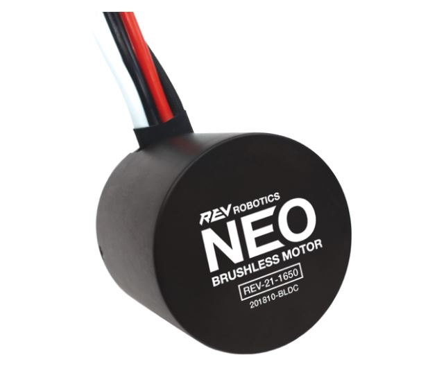
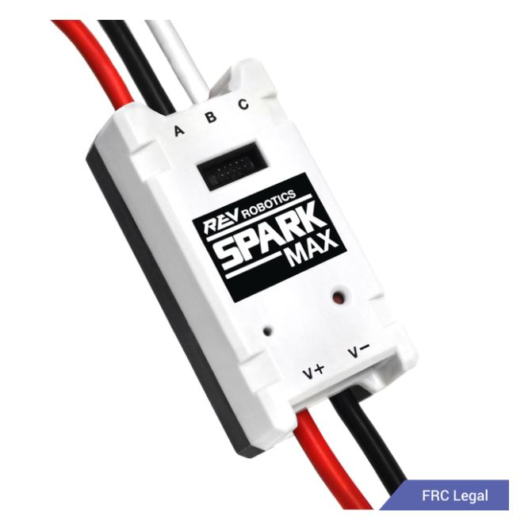
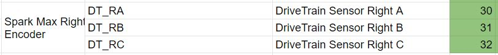
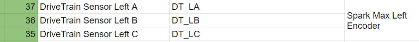
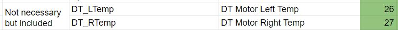
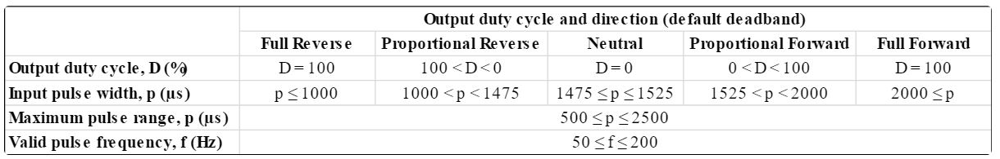

# Drivetrain Class
___
**Purpose:**
This class will contain methods that will control the drivetrain. 

___
## Hardware ##
___
<u>Neo Brushless Motor:</u>
* Quantity (2)
* Link (https://www.revrobotics.com/rev-21-1650/)
* Relevant Documentation:
    - Encoder Pin-Out (https://docs.revrobotics.com/sparkmax/feature-description/encoder-port)
    - Motor Connections (https://docs.revrobotics.com/sparkmax/feature-description/power-and-motor-connections)

 

<u>SPARK Max Motor Controller:</u>
* Quantity (2)
* Link (https://www.revrobotics.com/rev-11-2158/)
* Relevant Documentation:
    - PWM Mapping (https://docs.revrobotics.com/sparkmax/operating-modes/control-interfaces)
    - Motor Connection (https://docs.revrobotics.com/sparkmax/feature-description/power-and-motor-connections)

 

___
## Connection(s) ##
___

<u>Motor PWM:</u>

<u>Motor Encoder:</u>

**Optional:**
<u>Motor Temperature:</u>

 

____
**Basic movements:**
____

Methods include having the rover to be able to move **FORWARD** and **BACKWARDS**. Future implementation of **LEFT** and **RIGHT** movements will be considered. 

Initial joystick implementation in last year's competition where its 1:1 (joystick to drivetrain side). Hence two forward commands to the two left and right sides of the drivetrain.

This year's implementation shall try to control both sides of the drivetrain with one command. Hence, one method will set the speeed and direction of BOTH motors.

 

______
**Speed Adjustment:**
_______
Other than movements, speed adjustment of the motors will also be another functionality required. Two types of speed adjustment methods are considered: **Direct Input** and **Auto-Adjustment**.

 

**Direct speed adjustment:**

The physical user or controller inputting a numerical value, and the numerical data is sent directly to the motor driver.

 

**Auto-Adjustment:**

Due to the fact that not all DC motors will rotate at the same constant speed, auto-adjusting motor speeds should be considered so that one side of the rover will not be faster than the other. 

The implementation of this is only possible with the usage of a rotary encoder sensor to calculate the rotational speed in which will adjust the desired speed with the actual adjusted speed.  

* This feature will be implemented once interfacing with the 

 

___
**Hardware Interface:**
___

**Spark MAX controller:**

A PWM signal shall be passed to the controller from the Teensy to the motor controller. The documentation and boundaries of the signals (figure 1) that are to be sent to the the motor controller. Division math will be inputted in later.

<i>
Figure 1 (PWM Map of Spark Max)
</i>

Pins utilized in Teensy:
- 8 (Drivetrain Left)
- 9 (Drivetrain Right)

 

**Spark MAX Encoders:**

The encoders are alongside the NEO brushless motors, hence to access the data from the motors, we will be splicing the wires in order to ensure that the motor controller gets the required input for the encoder and the Teensy.

**Teensy 4.1:**

The Teensy will output a signal of 100 hz to the Spark Max. Based on the commands inputted, the Teensy will output a PWM frequency.